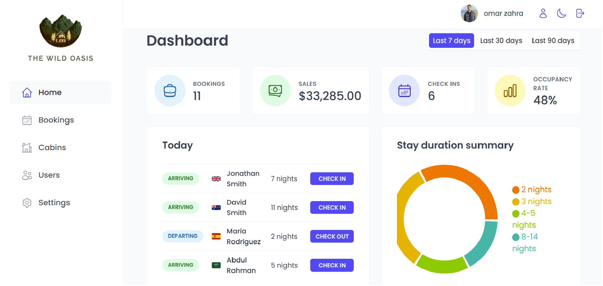
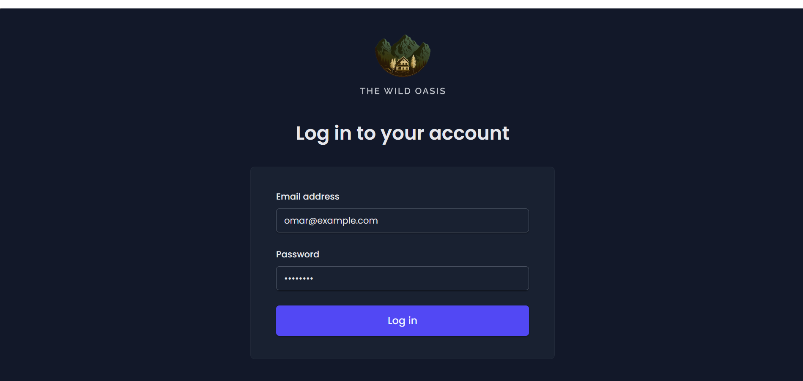
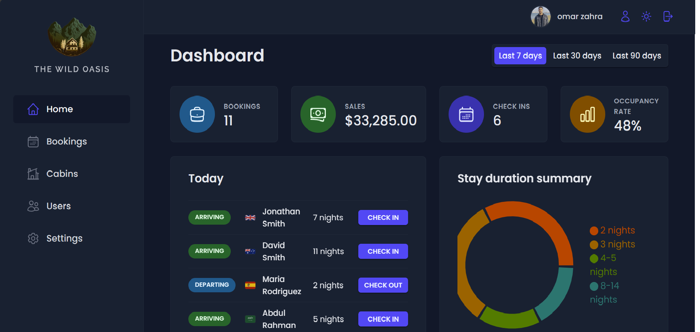
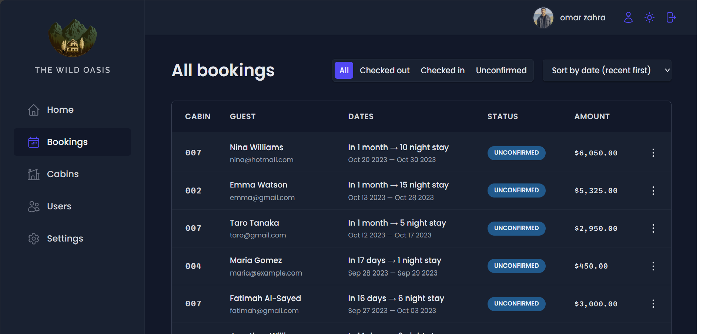
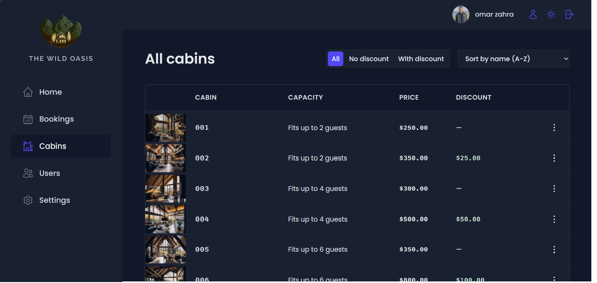
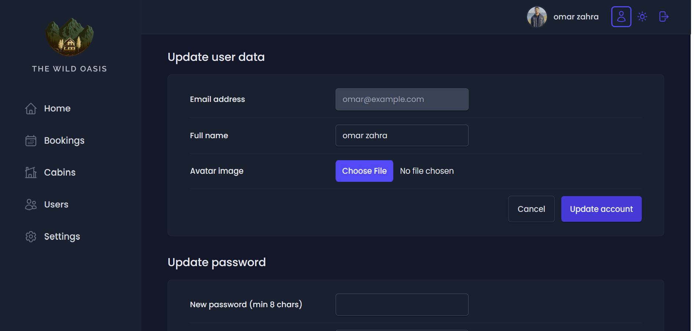

<div align="center">

  

  <br/>
  <br/>
  <p>
   The Wild Oasis is an  hotel management system built with React js,Styled components ,Supabase and many other technologies. It allows employees to manage everything about hotel bookings, cabins, and guests.
  </p>
</div>
</br>

## 💻 Technology Used

- **React**: JavaScript library for UI development.

- **Supabase**: Cloud database service for real-time and secure data storage.

- **@tanstack/react-query**: Data-fetching and state management library for React.

- **date-fns**: JavaScript date utility library for parsing, formatting, and manipulating dates.

- **react-router-dom**: Library for routing and navigation in React apps.

- **recharts**: Composable charting library for React.

- **styled-components**: CSS-in-JS library for styling React components.

- **react-hot-toast**: Customizable toast notification library for React.

- **react-icons**: Collection of customizable icons for React apps.

- **react-hook-form**: Library for form state management and validation in React.

## Features

**User Authentication and Signup:**

- Hotel employees can log in to the application to perform tasks.
- New users can only be signed up within the application to ensure that only actual hotel employees can create accounts.

**Profile Management:**

- Users can upload an avatar to personalize their profile.
- Users can change their name and password.

**Cabin Management:**

- The app provides a table view with all cabins.
- user can add/update/remove cabin

**Booking Management:**

- The app provides a table view with all bookings.

- user can filter or sort the table.
- user can confirm/delete/see more details for the booking.

  **Booking Operations:**

  - Users can delete, check in, or check out a booking as the guest arrives.
  - On check-in, users can accept payment outside the app and then confirm the payment within the app.
  - Guests can add breakfast for the entire stay during check-in if they haven't already.

  **Guest Data Management:**

  - Guest data contains full name, email, national ID, nationality, and a country flag for easy identification.

  **Dashboard:**

- For the last 7 days, 30 days or 90 days, the Home page screen is a display board that displays relevant information.

- It displays a list of visitors who check in and out on the current date, which enables users to do tasks related to these activities from their dashboard.

- Statistics about recent reservations, sales, security checks and occupancy rates are available on the dashboard.

- There is a chart showing all hotel sales per day, distinguished by the "overall" or "extras" category as well as breakfast only in hotels at present.

- There is also a chart that shows statistics about the length of time spent in our hotel, an important measure for us.

  **Application Settings:**

  - Application settings such as a breakfast price, minimum and full nights of booking or the most guests for each reservation can be defined by users.

**Dark Mode:**

- The app includes a dark mode.

<br/>

## Screenshots

<p align="center"></p>
<p align="center"></p>
<p align="center"></p>
<p align="center"></p>
<p align="center"></p>
<p align="center"></p>

<br/>

## 🛠️ Installation Steps:

<p>1. Clone the repository</p>

```
git clone  https://github.com/OmarZahrah/the-wild-oasis.git
```

<p>2. Install the required dependencies </p>

```
npm install
```

<p>3. Start the development server</p>

```
npm run dev
```

<p>4. Access the application at</p>

```
http://localhost:5173
```

<br/>
